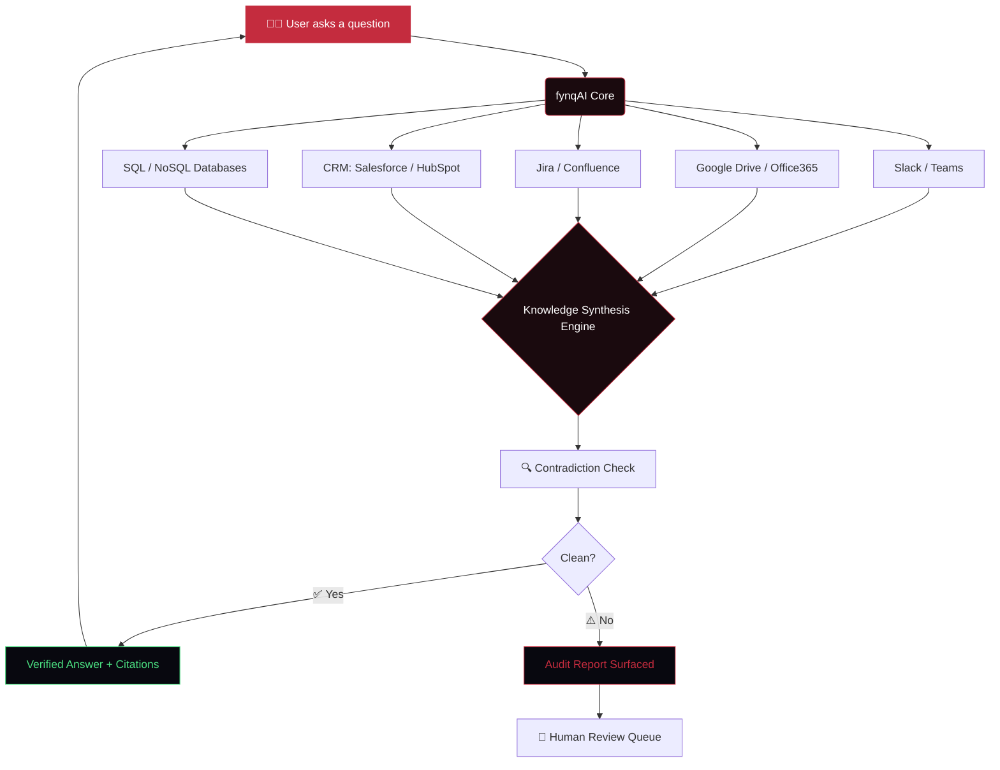

<div align="center">

<!-- ANIMATED BANNER SVG -->


<br/>

<!-- ANIMATED TYPING SVG -->


<br/><br/>

<!-- SHIELDS -->
<a href="https://github.com/AshwinRenjith/fynqAI.LP/stargazers">
  
</a>


<br/><br/>


</div>

---

<br/>

<div align="center">

```
╔════════════════════════════════════════════════════════════════╗
║                                                                ║
║    Your company has thousands of documents.                    ║
║    Dozens of tools. Hundreds of policies.                      ║
║                                                                ║
║    And zero way to know if any of it is consistent.            ║
║                                                                ║
║    Until now.                                                  ║
║                                                                ║
╚════════════════════════════════════════════════════════════════╝
```

</div>

<br/>

---

## ◈ What is fynqAI?

<table>
<tr>
<td width="50%" valign="top">

### The Problem

Every enterprise drowns in its own knowledge.

- 📄 **Thousands of documents** scattered across Confluence, Notion, Drive, email
- 🔁 **Contradictory policies** — *"Refunds within 30 days"* lives next to *"Refunds within 14 days"*
- ⏳ **Hours burned** searching for answers nobody is sure are correct
- ❓ **No single source of truth** across teams, tools, or time zones

</td>
<td width="50%" valign="top">

### The Solution

**fynqAI** is the intelligence layer that sits across all of it.

- 🧠 **Ask in natural language** — get verified answers with citations
- 🔍 **AI Audit Agent** — continuously scans for contradictions
- 🔐 **SOC2 Type II** — enterprise-grade security built in
- ⚡ **Sub-2s response time** — across 50+ integrated tools

</td>
</tr>
</table>

<br/>

---

## ◈ Architecture

<div align="center">



</div>

<br/>

---

## ◈ Tech Stack

<div align="center">

| Layer | Technology | Purpose |
|---|---|---|
| 🎨 **UI Framework** | React 19 + TypeScript | Component architecture |
| ⚡ **Build Tool** | Vite 7 | Lightning-fast dev + optimized builds |
| 🌌 **3D Rendering** | Three.js + `@react-three/fiber` | Hero particle network, value prop cylinder, orbit |
| 🎬 **Animation** | GSAP 3 + ScrollTrigger | All scroll-driven, cinematic animations |
| 📜 **Smooth Scroll** | Lenis | Physics-based scroll interpolation |
| 💅 **Styling** | CSS Modules + Custom Properties | Scoped, zero-runtime styles |
| 🔠 **Typography** | Inter (Variable) | Premium, legible at all weights |
| 🔎 **SEO** | react-helmet-async + JSON-LD | Complete on-page + structured data SEO |

</div>

<br/>

---

## ◈ Cinematic Sections

<details>
<summary><b>🌌  Scene 1 — Hero: Network Ignition</b></summary>

<br/>

A living, breathing `Three.js` particle network forms instant connections in the hero, representing your company's knowledge graph. As you scroll, it fades — beginning the story.

**Techniques used:**
- Custom `NetworkGraph` WebGL shader with dynamic connection rendering
- GSAP intro `timeline` with staggered text reveals
- Parallax pinning as the user scrolls into the next section

</details>

<details>
<summary><b>💥  Scene 2 — The Problem: Contradiction Clash</b></summary>

<br/>

A sticky scroll section cycles through three brutal statements with kinetic text swaps:

> *"Thousands of documents. Dozens of tools. Endless contradictions."*

Two conflicting policy cards then physically collide on screen with a glowing ⚠️ **Contradiction Detected** badge, visualizing exactly the pain fynqAI solves.

</details>

<details>
<summary><b>💬  Scene 3 — Conversational AI: Stacked Kinetics + UI Reveal</b></summary>

<br/>

Giant stacked typography ("STOP SEARCHING / START ASKING") scroll-scrubs into view. A glass-morphic chat UI then rises from the bottom — showing the AI answering *"What's the process for employee leave?"* with a real-time typing effect and source citation.

</details>

<details>
<summary><b>🔍  Scene 4 — The Audit Agent: Horizontal Scroll</b></summary>

<br/>

A horizontal scroll-jacking sequence walks through the Audit Agent's entire lifecycle in three cinematic cards: **The Conflict** → **The Detection** → **The Resolution**.

A live animated scan line pulses across two conflicting documents, with a real-time alert dashboard appearing at the end.

</details>

<details>
<summary><b>🧊  Scene 5 — Interface Reveal: Glass Scrub</b></summary>

<br/>

A particle vacuum effect pulls everything into a focal point. Then, a glassmorphic chat UI assembles itself — animated SVG border drawing, scroll-scrubbed typing, 3D document cards flying in from behind the camera, and a streaming AI response with citations.

</details>

<details>
<summary><b>🌐  Scene 6 — Ecosystem Orbit: Enterprise Integration Orrery</b></summary>

<br/>

A glowing `Three.js` wireframe sphere (the fynqAI Core) pulses in the center. Six enterprise integration icons orbit it in perfect synchronization, scroll-scrubbed with counter-rotation so they stay upright — a visual metaphor for everything fynqAI connects.

</details>

<details>
<summary><b>⚡  Scene 7 — Value Prop: 3D Typography Cylinder</b></summary>

<br/>

A rotating 3D typographic cylinder displays fynqAI's use cases — **FOR ONBOARDING / FOR COMPLIANCE / FOR LEGAL / FOR OPERATIONS** — pinned and scroll-scrubbed against a dynamic `BackgroundNodes` WebGL particle field.

</details>

<details>
<summary><b>🚀  Scene 8 — Footer CTA: Expanding Mask Reveal</b></summary>

<br/>

A glowing red pill expands via `clip-path` animation to fill the entire screen — revealing the email capture CTA with a premium glass input field and demo booking button.

</details>

<br/>

---

## ◈ Getting Started

```bash
# Clone the repository
git clone https://github.com/AshwinRenjith/fynqAI.LP.git
cd fynqAI.LP/my-fynq-app

# Install dependencies
npm install

# Start the dev server
npm run dev
# → http://localhost:5173

# Production build (with Three.js code-splitting)
npm run build
```

<br/>

---

## ◈ SEO Architecture

This landing page is engineered for **#1 Google ranking** across branded and non-branded terms.

<div align="center">

| Signal | Implementation |
|---|---|
| 📊 **JSON-LD Schemas** | Organization, WebSite (SearchAction), SoftwareApplication, FAQPage |
| 🗺️ **Sitemap** | `/public/sitemap.xml` — submitted to Search Console |
| 🤖 **robots.txt** | Full crawl permission + sitemap pointer |
| 🎴 **OG Image** | Branded 1200×630 social preview card |
| 🏷️ **Section IDs** | `#conversational-ai` `#audit-agent` `#integrations` `#contact` |
| ♿ **Accessibility** | ARIA labels, semantic `<nav>`, screen-reader text |
| 🎭 **WebGL Fallback** | SR-only DOM text for all 3D canvas content |
| ⚡ **Font Loading** | Preconnect in HTML (non-render-blocking) |
| 🧩 **Code Splitting** | Three.js → `three-vendor`, GSAP → `gsap-vendor` |
| 📵 **Noscript** | Full keyword-rich HTML content for non-JS crawlers |

</div>

**Target Keywords:** `fynq` · `fynqAI` · `enterprise AI` · `AI audit agent` · `knowledge intelligence` · `document contradiction detection` · `conversational AI enterprise` · `SOC2 AI platform` · `auditing AI agent`

<br/>

---

## ◈ Design System

The **Liquid Glass Design System** — precision aesthetics with fluid refraction effects.

<div align="center">

```
 Color Palette
 ┌─────────────────────────────────────────────────────────┐
 │                                                         │
 │   ██████████   Obsidian   #05050A  (Deepest dark)      │
 │   ██████████   Background #08080F  (Page base)         │
 │   ██████████   Surface    #111118  (Cards)             │
 │   ██████████   Ember      #C42C3E  (Accent / CTA)      │
 │   ░░░░░░░░░░   Muted      #6B7080  (Secondary text)    │
 │                                                         │
 └─────────────────────────────────────────────────────────┘

 Effects
 ┌─────────────────────────────────────────────────────────┐
 │  Glass BG   rgba(255, 255, 255, 0.025)                 │
 │  Glass Blur backdrop-filter: blur(20px)                │
 │  Gradient   #FFFFFF → rgba(255,255,255,0.45)           │
 └─────────────────────────────────────────────────────────┘
```

</div>

<br/>

---

## ◈ Performance Targets

<div align="center">

| Metric | Target | Strategy |
|---|---|---|
| **LCP** (Largest Contentful Paint) | < 2.5s | Lazy-loaded 3D canvases, preconnect fonts |
| **FID** (First Input Delay) | < 100ms | Code-split Three.js bundle |
| **CLS** (Cumulative Layout Shift) | < 0.1 | Fixed-height canvas containers |
| **Bundle — Initial** | < 150kb | React + routing only |
| **Bundle — 3D Vendor** | Deferred | Loaded only when scrolled to |

</div>

<br/>

---

## ◈ Project Structure

```
fynqAI.LP/
└── my-fynq-app/
    ├── public/
    │   ├── favicon.svg          ← Branded "fq" monogram
    │   ├── og-image.png         ← 1200×630 social card
    │   ├── robots.txt           ← Crawler directives
    │   ├── sitemap.xml          ← Google Search Console
    │   └── site.webmanifest     ← PWA manifest
    ├── src/
    │   ├── components/
    │   │   ├── Hero.tsx                 ← 3D Network + intro animation
    │   │   ├── NetworkGraph.tsx         ← WebGL particle network
    │   │   ├── ProblemSection.tsx       ← Sticky scroll contradiction
    │   │   ├── FeatureOne.tsx           ← Kinetic text + UI reveal
    │   │   ├── FeatureTwo.tsx           ← Horizontal scroll audit
    │   │   ├── InterfaceReveal.tsx      ← Glass chat scrub
    │   │   ├── EcosystemOrbit.tsx       ← 3D orbit + scroll scrub
    │   │   ├── ValueProp.tsx            ← 3D typography cylinder
    │   │   └── FooterCTA.tsx            ← Clip-path CTA reveal
    │   ├── App.tsx                      ← Root + Lenis + Helmet
    │   └── index.css                    ← Liquid Glass design tokens
    ├── index.html                       ← JSON-LD + full SEO meta
    └── vite.config.ts                   ← Code-splitting config
```

<br/>

---

## ◈ Integrations

<div align="center">


<br/>


**50+ integrations and growing.**

</div>

<br/>

---

## ◈ License & Contact

<div align="center">

<table>
<tr>
<td align="center" width="33%">

**Built with**

[](https://react.dev)
[](https://typescriptlang.org)
[](https://vitejs.dev)

</td>
<td align="center" width="33%">

**Contact**

📧 [hello@fynq.ai](mailto:hello@fynq.ai)
🌐 [fynq.ai](https://fynq.ai)
🐦 [@fynqAI](https://twitter.com/fynqAI)

</td>
<td align="center" width="33%">

**© 2026 fynqAI**

All rights reserved.
Built with ❤️ and
a dangerous amount
of GSAP.

</td>
</tr>
</table>

<br/>


</div>
